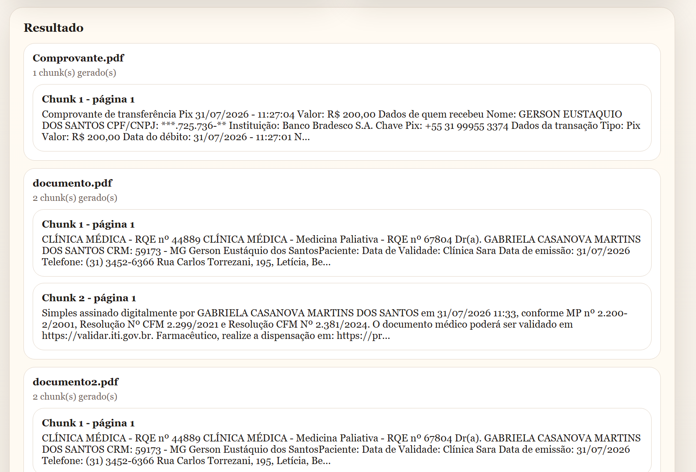
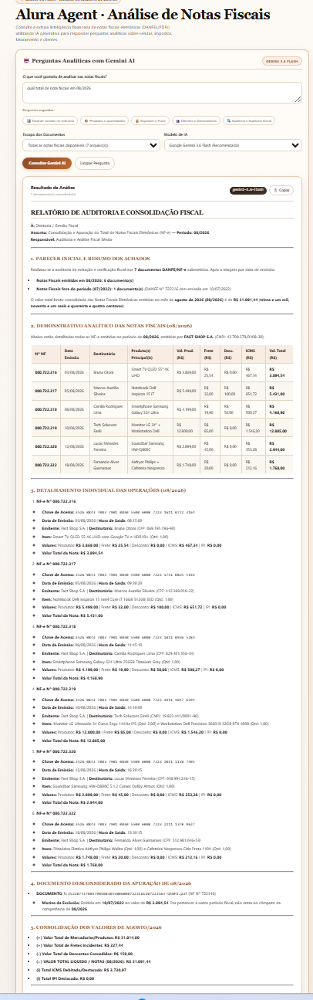

# Alura Agent - Processador e Visualizador de Chunks de PDF

Interface web desenvolvida em **Flask** para ingestão, fragmentação (chunking), busca textual e visualização de dados extraídos de documentos PDF.

O aplicativo está hospedado e em execução em uma instância na **Oracle Cloud Infrastructure (OCI)**:
🌐 **Acesso online:** [http://147.15.87.131](http://147.15.87.131)

---

## 📸 Demonstração

| Interface Principal | Processamento e Visualização |
| :---: | :---: |
|  |  |

---

## 🚀 Funcionalidades

- **Upload de Documentos:** Envio de novos arquivos `.pdf` diretamente pela interface web para o servidor.
- **Seleção de Arquivos Existentes:** Listagem e processamento sob demanda dos PDFs já armazenados no diretório `pdf/`.
- **Busca por Conteúdo:** Filtragem automática de documentos baseada em termos específicos (ex: nome, CPF, etc.).
- **Processamento e Chunking:** Segmentação dos PDFs em chunks estruturados, extraindo metadados como identificador (`id`), página e resumo de texto.

---

## 🛠️ Tecnologias Utilizadas

- **Python 3.11+**
- **Flask** (Framework Web)
- **Gunicorn** (WSGI HTTP Server)
- **Nginx** (Reverse Proxy na porta 80)
- **Oracle Cloud Infrastructure (OCI)** (Hospedagem da VM)

---

## 📂 Estrutura do Projeto

```text
Challenge/
├── Image/
│   ├── IMGA.png           # Captura da interface principal
│   └── IMGb.png           # Captura dos chunks processados
├── pdf/                   # Diretório de armazenamento dos documentos PDF
├── src/
│   ├── main.py            # Aplicação principal Flask e rotas
│   └── document_loader.py # Lógica de extração, segmentação e filtros
├── templates/
│   └── index.html         # Interface HTML (Jinja2)
├── requirements.txt       # Dependências do projeto
├── start.sh               # Script de inicialização em produção
└── README.md
```

---

## ⚙️ Instalação e Execução Local

1. **Clone o repositório:**
   ```bash
   git clone [https://github.com/GersonESantos/Challenge.git](https://github.com/GersonESantos/Challenge.git)
   cd Challenge
   ```

2. **Crie e ative um ambiente virtual:**
   ```bash
   python -m venv venv
   # No Linux/macOS:
   source venv/bin/activate
   # No Windows:
   venv\Scripts\activate
   ```

3. **Instale as dependências:**
   ```bash
   pip install --upgrade pip
   pip install -r requirements.txt
   ```

4. **Execute o servidor de desenvolvimento:**
   ```bash
   python src/main.py
   ```

5. **Acesse no navegador:**
   ```text
   [http://127.0.0.1:5000](http://127.0.0.1:5000)
   ```

---

## ☁️ Deploy em Produção (Oracle Linux / SELinux)

Em ambiente de produção, a aplicação roda gerenciada via **systemd** e **Gunicorn**, com **Nginx** atuando como proxy reverso na porta 80:

```bash
# Execução via Gunicorn
python -m gunicorn --workers 2 --bind 127.0.0.1:5000 --chdir src main:app
```

---

## 👤 Autor

Desenvolvido por **[Gerson Eustaquio dos Santos](https://github.com/GersonESantos)**.